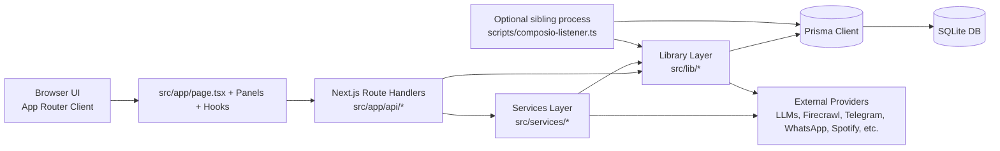

# JARVIS

A local-first, personal desktop-oriented AI control surface built with **Next.js App Router**.

JARVIS combines chat + voice interaction, automation, research, memory, multimodal input, and communication tooling behind a single dashboard. It is currently **experimental / alpha** software and is best treated as an actively evolving personal system.

> A little personality, a lot of control.

## Table of contents
- [What this project is](#what-this-project-is)
- [Feature overview](#feature-overview)
- [Architecture](#architecture)
- [Repository layout](#repository-layout)
- [Getting started](#getting-started)
- [Run modes](#run-modes)
- [Environment variables](#environment-variables)
- [Feature-to-code map](#feature-to-code-map)
- [Safety and platform notes](#safety-and-platform-notes)
- [Troubleshooting](#troubleshooting)
- [Contributing](#contributing)
- [Testing status](#testing-status)
- [License and project status](#license-and-project-status)

## What this project is
JARVIS in this repository is a **Next.js 14.2.35 + TypeScript** application located in the nested [`jarvis/`](./jarvis) directory.

It is designed as a personal AI desktop interface that can:
- run assistant and agent workflows,
- store memory and user context,
- perform web research and browser automation,
- interact with communication channels (Telegram, WhatsApp, email-related flows),
- orchestrate OS and device-adjacent actions,
- provide multimodal controls (voice, vision, gestures, sentinel-style monitoring).

## Feature overview
### 1) Assistant and voice
- Streaming chat and assistant orchestration
- Voice input/output flows and always-listening behaviors
- Mission/agent-style goal execution

### 2) Memory and companion features
- Persistent memory, conversations, notes, and tasks (Prisma + SQLite)
- Companion-style follow-ups, mood/history-aware interactions
- Knowledge graph entities and relationships

### 3) Research and web intelligence
- Firecrawl-backed research and scraping paths
- Structured research/report flows
- Multi-provider model integrations for synthesis

### 4) Browser automation and agents
- Browser operation panels and route handlers
- Playwright-based automation services and run history
- Watcher jobs and recurring checks

### 5) Vision, gesture, sentinel
- Camera/screen-aware routes and hooks
- Gesture/hand/eye/face controls via MediaPipe-related modules
- Sentinel watcher and biometric-oriented flows

### 6) Communication and integrations
- Telegram queue/reminders/location/remote control pathways
- WhatsApp integration modules
- Composio-connected app/event pipelines
- Spotify and other service integrations

### 7) Productivity
- Tasks, notes, reminders, scheduling, reports
- Calendar/news/weather and utility panels
- Agent/briefing workflows

### 8) Visual interface
- 3D Arc Reactor UI (Three.js + React Three Fiber)
- Panel-based desktop dashboard with Zustand global state
- Motion-heavy UI (Framer Motion + Tailwind theme system)

## Architecture


### Request/data flow (high level)
1. The dashboard in `src/app/page.tsx` composes panels, hooks, and global state.
2. User actions (chat, panel commands, automation tasks) call `src/app/api/*` route handlers.
3. Route handlers delegate to `src/services/*` orchestration and `src/lib/*` lower-level modules.
4. Persistence flows through Prisma (`src/lib/db/queries.ts`) into SQLite (`DATABASE_URL`).
5. Integrations call external providers only when their related features are used.
6. Optional background listener (`scripts/composio-listener.ts`) runs as a separate process for Composio triggers/email dispatch.

## Repository layout
> Important: the application root is **`jarvis/`**, not the repository root.

```text
Jarvis/
├─ README.md                      # This file (repo-level guide)
├─ .env.example                   # Environment template (copy into jarvis/.env.local)
├─ start-jarvis.bat               # Windows helper: starts app (+ composio listener window)
├─ start-with-whatsapp.bat        # Windows helper: starts WhatsApp server + app
├─ run-whatsapp-and-jarvis.bat    # Windows helper (machine-specific path assumptions)
├─ setup-n8n.bat                  # Windows helper for n8n setup
├─ setup-workflows.bat            # Windows helper for n8n workflow files
└─ jarvis/                        # Main Next.js application root
   ├─ package.json                # Real app scripts: dev/build/start/lint/hotkey
   ├─ next.config.mjs             # Next config, instrumentation hook, CSP, webpack fallback
   ├─ tailwind.config.ts          # JARVIS theme/colors/fonts/animations
   ├─ prisma/
   │  └─ schema.prisma            # SQLite datasource + core domain models
   ├─ public/                     # Static assets
   ├─ docs/
   │  └─ DESKTOP_REDESIGN_PROPOSAL.md
   ├─ scripts/
   │  ├─ composio-listener.ts     # Optional sibling listener process
   │  └─ e2e-*.mjs                # Ad-hoc/debug E2E scripts
   └─ src/
      ├─ app/                     # App Router pages/layout + API route handlers
      │  └─ api/                  # Chat, agents, browser, memory, tasks, comms, etc.
      ├─ components/
      │  ├─ panels/               # Feature panels
      │  ├─ reactor/              # Arc reactor 3D components
      │  └─ ui/                   # Reusable interaction controls
      ├─ hooks/                   # Voice/sentinel/gesture/biometric/device hooks
      ├─ services/                # Orchestration/business logic
      ├─ lib/                     # Lower-level modules (agent/browser/db/comms/os/etc.)
      ├─ store/
      │  └─ jarvis.store.ts       # Global Zustand state
      └─ instrumentation.ts       # Server startup watcher heartbeat + DB warmup
```

## Getting started
### Prerequisites
- Node.js 18+ (Node 20 recommended)
- npm
- SQLite (via Prisma `DATABASE_URL`, default is local file)
- Optional: credentials for integrations you plan to use

### Happy-path setup
```bash
git clone https://github.com/juug24btech22417-del/Jarvis.git
cd Jarvis/jarvis
npm install
```

Copy the root environment template into the app directory:

```bash
# from Jarvis/jarvis
cp ../.env.example .env.local
```

Windows PowerShell equivalent:

```powershell
Copy-Item ..\.env.example .env.local
```

Then edit `jarvis/.env.local` and set at least:
- `DATABASE_URL="file:./dev.db"` (or your custom path)

Initialize Prisma and start development:

```bash
npx prisma generate
npx prisma db push
npm run dev
```

Open: `http://localhost:3000` (unless you changed ports).

### Notes on env loading
- Next.js runtime env is read from the **application directory** (`jarvis/.env.local`).
- The optional Composio listener also expects `.env.local` in the `jarvis/` working directory.
- Most external API keys are optional unless you use the related feature paths.

## Run modes
From `Jarvis/jarvis`:

| Mode | Command | Purpose |
|---|---|---|
| Development | `npm run dev` | Start local dev server |
| Build | `npm run build` | Create production build |
| Production start | `npm run start` | Run built app |
| Lint | `npm run lint` | Run Next.js ESLint rules |
| Windows hotkey listener | `npm run hotkey` | Runs `scripts/hotkey-listener.ps1` |

### Optional Composio listener (no package script)
```bash
# from Jarvis/jarvis
npx --yes tsx scripts/composio-listener.ts
```

## Environment variables
Use [`.env.example`](./.env.example) as the canonical template.

Suggested grouping:
- **Core app**: `NEXT_PUBLIC_APP_URL`, `DATABASE_URL`
- **Web/research**: `FIRECRAWL_API_KEY`, `TAVILY_API_KEY`
- **Model providers**: OpenAI / Google(Gemini) / Anthropic / Hugging Face and related provider keys
- **Communication**: Telegram/WhatsApp-related tokens and IDs
- **Service integrations**: Spotify, Instagram, Composio, and other optional APIs
- **Internal routing overrides**: `INTERNAL_BASE_URL`, `INTERNAL_API_URL` (when needed)

### Security hygiene
Never commit:
- `.env.local`
- API keys/tokens/session files
- local SQLite databases (`*.db`)
- auth caches (e.g., WhatsApp/browser session artifacts)

## Feature-to-code map
| Capability | Primary code locations |
|---|---|
| Dashboard composition root | [`jarvis/src/app/page.tsx`](./jarvis/src/app/page.tsx) |
| API route surface | [`jarvis/src/app/api/`](./jarvis/src/app/api) |
| Agent orchestration | [`jarvis/src/services/AgentService.ts`](./jarvis/src/services/AgentService.ts), [`jarvis/src/lib/agent/`](./jarvis/src/lib/agent) |
| Research orchestration | [`jarvis/src/services/ResearchService.ts`](./jarvis/src/services/ResearchService.ts), [`jarvis/src/services/OracleResearchService.ts`](./jarvis/src/services/OracleResearchService.ts), [`jarvis/src/app/api/research/`](./jarvis/src/app/api/research) |
| Persistence and domain queries | [`jarvis/prisma/schema.prisma`](./jarvis/prisma/schema.prisma), [`jarvis/src/lib/db/queries.ts`](./jarvis/src/lib/db/queries.ts) |
| Global state | [`jarvis/src/store/jarvis.store.ts`](./jarvis/src/store/jarvis.store.ts) |
| 3D reactor interface | [`jarvis/src/components/reactor/`](./jarvis/src/components/reactor) |
| Panels and UX modules | [`jarvis/src/components/panels/`](./jarvis/src/components/panels), [`jarvis/src/components/ui/`](./jarvis/src/components/ui) |
| Multimodal hooks | [`jarvis/src/hooks/`](./jarvis/src/hooks) |
| Startup instrumentation | [`jarvis/src/instrumentation.ts`](./jarvis/src/instrumentation.ts) |
| Optional background process | [`jarvis/scripts/composio-listener.ts`](./jarvis/scripts/composio-listener.ts) |

Further reading: [`jarvis/docs/DESKTOP_REDESIGN_PROPOSAL.md`](./jarvis/docs/DESKTOP_REDESIGN_PROPOSAL.md)

## Safety and platform notes
- Significant functionality is **Windows-oriented** (PowerShell scripts, OS command integrations, desktop/screen tooling, volume/system controls).
- Browser/camera/microphone/screen features may require explicit OS/browser permissions.
- External APIs/providers have separate quotas, rate limits, and billing.
- Agent/system command paths include approval/safeguard logic in implementation, but you should still run only with trusted credentials and integrations.
- Treat this as a personal control surface: only connect accounts/services you trust.

## Troubleshooting
### 1) Wrong working directory
Symptom: missing scripts/dependencies, Prisma errors, env not loaded.

Fix: run app commands from:
```bash
/home/runner/work/Jarvis/Jarvis/jarvis
```

### 2) Missing environment variables
Symptom: provider/integration routes fail or return key-missing errors.

Fix:
- Ensure `jarvis/.env.local` exists
- Start from `../.env.example`
- Populate only keys for features you use

### 3) Prisma / SQLite initialization issues
Symptom: runtime DB errors (`table not found`, Prisma client issues).

Fix:
```bash
cd /home/runner/work/Jarvis/Jarvis/jarvis
npx prisma generate
npx prisma db push
```
Verify `DATABASE_URL` points to a writable location.

### 4) Playwright/Puppeteer browser dependency errors
Symptom: browser automation endpoints fail to launch browser binaries.

Fix:
```bash
cd /home/runner/work/Jarvis/Jarvis/jarvis
npx playwright install
```
Also verify OS-level dependencies for headless/headful browser usage.

### 5) Camera/microphone/screen capture not working
Symptom: vision/voice/sentinel features appear inactive.

Fix:
- Grant browser permissions for camera/microphone/screen
- Confirm no other app is locking the device
- Check OS privacy settings

### 6) Windows-only features on macOS/Linux
Symptom: PowerShell/system-control/hotkey paths fail.

Fix:
- Use cross-platform features only, or
- run those modules on Windows where they are implemented/tested

### 7) Port/base URL mismatch (`NEXT_PUBLIC_APP_URL` / internal base URLs)
Symptom: internal callbacks or generated links point to wrong origin.

Fix:
- Set `NEXT_PUBLIC_APP_URL` to your active app URL
- If needed for server-to-server calls, set `INTERNAL_BASE_URL` / `INTERNAL_API_URL` consistently
- Ensure any helper script assumptions match your actual port

## Contributing
This is an experimental personal project, but contributions are welcome.

Recommended workflow:
1. Create a branch from `master`
2. Keep changes focused and scoped
3. Never commit secrets (`.env.local`, tokens, session folders, databases)
4. Run checks where possible:
   - `npm run lint`
   - `npm run build` (when relevant)
5. If adding integrations, document required env vars and setup steps
6. Update this README or docs when adding new modules/flows

## Testing status
There is currently **no standard `npm test` command** for the main app in `jarvis/package.json`.

The repository includes ad-hoc/debug scripts and E2E-style scripts (for example under [`jarvis/scripts/`](./jarvis/scripts)), but no unified automated test command is defined yet.

## License and project status
- A dedicated top-level `LICENSE` file is currently not present in this repository.
- Package metadata exists, but if you plan to redistribute or reuse code, confirm licensing expectations with the repository owner first.
- Project maturity: active, experimental/alpha, and subject to breaking changes.
