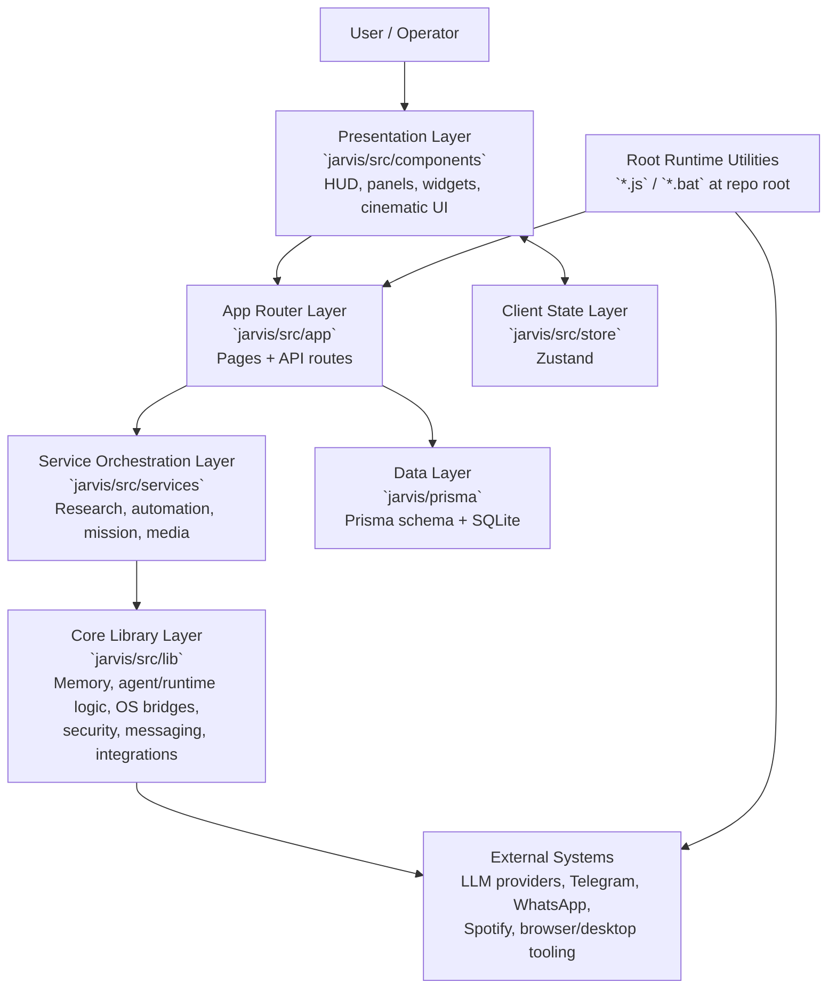

# J.A.R.V.I.S.
### Just A Rather Very Intelligent System

A cinematic, modular AI assistant platform built with **Next.js + TypeScript**. JARVIS combines a rich interactive UI, API-driven automations, local system controls, and multi-service integrations (LLMs, messaging, web automation, and more).

---

## Table of Contents
- [Overview](#overview)
- [Capabilities at a Glance](#capabilities-at-a-glance)
- [Capability Availability](#capability-availability)
- [Project Architecture](#project-architecture)
- [Directory Structure](#directory-structure)
- [How to Clone or Download](#how-to-clone-or-download)
- [Local Setup](#local-setup)
- [Environment Variables](#environment-variables)
- [Available Scripts](#available-scripts)
- [Tech Stack](#tech-stack)
- [Notes](#notes)

---

## Overview
JARVIS is organized as a main repository with a dedicated app workspace in `jarvis/`.

It includes:
- A futuristic React/Next.js frontend with multiple operational panels
- A large set of server routes under `src/app/api/*` for assistant features
- Service and integration layers for research, browser automation, scheduling, and messaging
- Prisma + SQLite persistence for memory, tasks, reports, reminders, and automations
- Optional WhatsApp server bridge for persistent messaging connectivity
- A system-wide clipboard assistant (`npm run clipboard`) that detects copied content and offers the right actions

---

## Capabilities at a Glance
JARVIS is designed as an operations-grade AI copilot: conversational, multimodal, and automation-ready. It blends premium command-center UX with practical execution across research, messaging, browser workflows, and local system control.

- **🧠 AI Workflows + Mission Orchestration**
  - Conversational workflows across OpenAI, Gemini, Anthropic, and Hugging Face, with mission-style planning, checkpoints, and follow-up execution.
  - Mission Control as a true orchestration surface for chaining multi-step browser, research, messaging, and system actions.
  - Compound missions can coordinate outcomes in one flow (for example: find top-rated nearby options, open directions, and message a contact), depending on enabled integrations.

- **🔎 Research, Reporting, and Meeting Intelligence**
  - Deep research pipelines: query planning, web search/scrape/extract, synthesis, report persistence, and follow-up retrieval.
  - Real-time **Meeting Shadow** assistance: transcript-snippet analysis with meeting-topic context, concise tactical talking points, counter-arguments, and optional private whisper-style voice playback.
  - Meeting workflows include live caption capture/sync and structured post-meeting outputs where integrations are configured.

- **🎙️ Voice, Persona, and Communication Surfaces**
  - Voice interaction with transcription + text-to-speech, plus persona/tone controls (language, rate, pitch, style).
  - Telegram command operations for voice/text/media/reminders/briefings, with optional WhatsApp bridge workflows.
  - AI-assisted email composition with tone control, plus sending via configured email integrations.

- **🌐 Browser Automation + Record-and-Repeat Runtime**
  - Autonomous browser execution for real web tasks (forms, sign-ins, extraction, comparisons, checkout-prep flows).
  - Entertainment/navigation automation for scroll-style feeds (such as reels/shorts-style experiences) where browser/session conditions allow.
  - Record-and-repeat automation across browser and desktop: recording, replay, parameterized steps, screenshots, form-fill history, and analytics surfaces.
  - Commerce and task automation can drive supported shopping/ordering journeys through browser automation, with user configuration, permissions, and confirmation gates.

- **💻 Desktop, Filesystem, and Context Intelligence**
  - System controls and telemetry where supported: screenshots, app/URL launch, lock/sleep/shutdown, audio/brightness, and hardware/network status.
  - Network-awareness workflows can incorporate connectivity context and IP/location-aware provider responses when supporting integrations are configured.
  - Clipboard intelligence includes background capture/watch flows and context-aware assistance pipelines (with platform/runtime qualification).
  - Filesystem integration supports local read/write/search workflows within configured and permitted boundaries.
  - Persistent memory/task/report state via Prisma + SQLite for continuity across sessions.

- **🧩 Integrations for Developer + Productivity Work**
  - GitHub integration paths for repository exploration and developer workflows (repos, code, issues, PRs, commits, and related actions where authorized).
  - Notion and Todoist integrations for research delivery, notes, action-item sync, and productivity execution.
  - NASA integration for APOD and related astronomy/space imagery experiences.
  - CAD/design workflow support via MCP CAD tooling and generated parametric model flows (integration capability, not a full standalone CAD engine).

- **👁️ Sensor-Driven Interaction + Cinematic UX**
  - Hand and eye interaction where supported: gaze-based cursor control, gesture/air-mouse control, and gesture-based media controls.
  - Sentinel/security command surfaces for armed-state flows, alerts, and monitoring hooks where configured.
  - Cinematic command-center UI with HUD panels, motion/3D layers, live status rails, and operator feedback loops.

---

## Capability Availability
- **Core by default:** command-center UI, core assistant routing, API surfaces, and local persistence.
- **Optional integrations:** services such as WhatsApp, GitHub, Notion, Todoist, NASA, advanced email, maps, and CAD flows require setup, credentials, and/or external providers.
- **Platform and permission dependent:** desktop controls, clipboard watcher behavior, hand/eye controls, and some media/security features depend on OS support plus camera/microphone/browser permissions.
- **Safety and confirmation:** execution on live websites and outbound actions (including commerce or email flows) may require explicit user confirmation, authenticated sessions, and configured safeguards.

## Project Architecture
The system is organized in layered modules with a shared integration surface:



### Architecture Mapping
- **Presentation Layer**: `jarvis/src/components/*` (reactor, panels, cinematic surfaces, control overlays)
- **Routing + API Layer**: `jarvis/src/app/*` (UI routes + `api/*/route.ts` server handlers)
- **Service Layer**: `jarvis/src/services/*` (orchestration and workflow composition)
- **Core Library Layer**: `jarvis/src/lib/*` (shared domain modules and integration clients)
- **State Layer**: `jarvis/src/store/jarvis.store.ts`
- **Data Layer**: `jarvis/prisma/schema.prisma` + migrations
- **Runtime Utility Layer**: root scripts and helper entry points (server bridges, debug/bootstrap scripts)

---

## Directory Structure
```text
Jarvis/
├─ .agents/                     # Local agent skills and support assets
├─ README.md
├─ .env.example
├─ package.json
├─ package-lock.json
├─ prisma/                      # Root-level Prisma schema/assets
├─ whatsapp-server.js           # Optional WhatsApp bridge server
├─ *.bat                        # Windows bootstrap and workflow helpers
├─ test-*.js                    # Root integration/debug test scripts
├─ jarvis/                      # Main Next.js application workspace
│  ├─ package.json
│  ├─ next.config.mjs
│  ├─ docs/                     # App-specific design/ops notes
│  ├─ scripts/                  # App automation/e2e helper scripts
│  ├─ scratch/                  # Local experiments and diagnostics
│  ├─ notes/                    # User notes and generated text artifacts
│  ├─ prisma/
│  │  ├─ schema.prisma
│  │  └─ migrations/
│  ├─ public/                   # Static assets, vision/model artifacts
│  ├─ src/
│  │  ├─ app/                   # App Router pages + API route handlers
│  │  ├─ components/            # UI panels, HUD, reactor, cinematic modules
│  │  ├─ hooks/                 # Client hooks (voice, gesture, sentinel, etc.)
│  │  ├─ lib/                   # Core runtime logic and integrations
│  │  ├─ services/              # Feature orchestration services
│  │  ├─ store/                 # Zustand state
│  │  └─ types/
│  ├─ tests/                    # App-level test suites
│  └─ tsconfig.json
└─ debug and integration helpers at repository root
```

---

## How to Clone or Download
### Option A — Clone with Git (recommended)
```bash
git clone https://github.com/juug24btech22417-del/Jarvis.git
cd Jarvis
```

### Option B — Download ZIP
1. Open the repository on GitHub.
2. Click **Code** → **Download ZIP**.
3. Extract the archive.
4. Open a terminal in the extracted `Jarvis` folder.

---

## Local Setup
> Main app commands run from the `jarvis/` directory.

1. Install root dependencies (for root utilities):
```bash
npm install
```

2. Move into the app workspace and install app dependencies:
```bash
cd jarvis
npm install
```

3. Create local environment file:
```bash
cp ../.env.example .env.local
```
> On Windows PowerShell:
```powershell
Copy-Item ..\.env.example .env.local
```

4. Configure `.env.local` with your API keys and credentials.

5. Initialize database:
```bash
npx prisma db push
```

6. Start development server:
```bash
npm run dev
```

7. Open:
- `http://localhost:3000` (default Next.js dev port)

---

## Environment Variables
The template is in `.env.example` (repository root).

Key groups:
- **Core**: app URL
- **Web Intelligence**: Firecrawl, Tavily
- **AI Models**: OpenAI, Gemini, Anthropic, Hugging Face
- **Communication**: WhatsApp, Telegram
- **Services**: Spotify, Instagram
- **Database**: `DATABASE_URL` (SQLite)

Never commit real secrets.

---

## Available Scripts
From `jarvis/`:
- `npm run dev` — start dev server
- `npm run build` — production build
- `npm run start` — run production build
- `npm run lint` — run lint checks
- `npm run test` — run test suites
- `npm run hotkey` — start PowerShell hotkey listener
- `npm run clipboard` — start clipboard watcher
- `npm run whatsapp:server` — launch root WhatsApp bridge (`../whatsapp-server.js`)

---

## Tech Stack
- **Frontend/App**: Next.js 14, React 18, TypeScript
- **Styling/UX**: Tailwind CSS, Framer Motion, Three.js / React Three Fiber
- **State**: Zustand
- **Data**: Prisma + SQLite
- **Automation/Integrations**: Playwright, Firecrawl, Telegram, WhatsApp Web
- **AI Integrations**: OpenAI, Gemini, Anthropic, Hugging Face

---

## Notes
- This repository contains both the main app (`jarvis/`) and root-level integration scripts.
- Some integrations require platform-specific tools (especially certain Windows/PowerShell flows).
- If optional integrations are not configured, core UI/dev workflows can still run.

---

Built for an ambitious, modular AI assistant experience.
